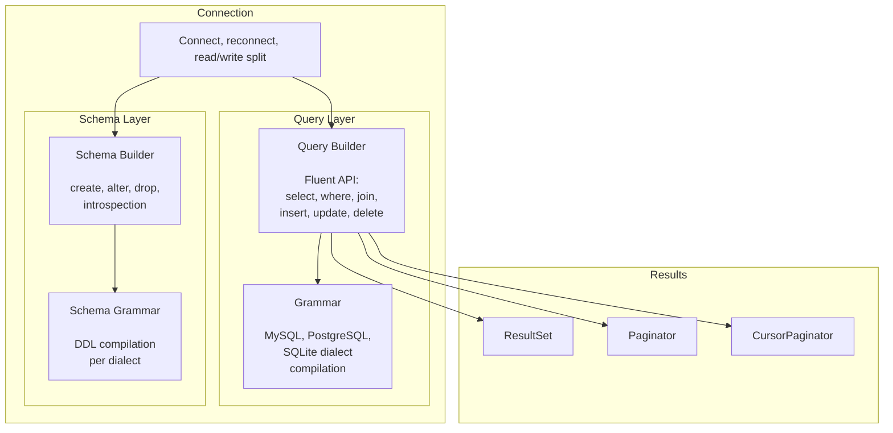
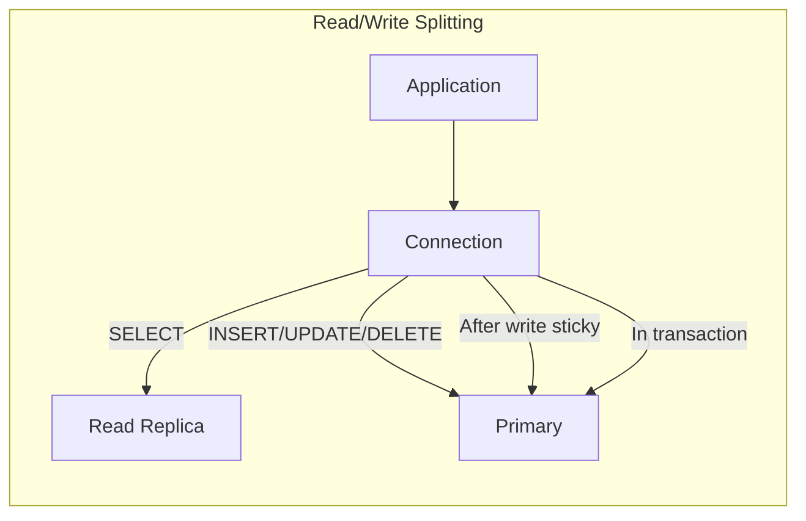

# phpdot/database

Query builder, schema management, and migrations for PHP. Built on Doctrine DBAL.

## Install

```bash
composer require phpdot/database
```

Supports MySQL 5.7+, MariaDB 10.4+, PostgreSQL 12+, SQLite 3.25+.

## Quick Start

```php
use PHPdot\Database\Connection;
use PHPdot\Database\Config\DatabaseConfig;

$db = new Connection(new DatabaseConfig(
    driver: 'mysql',
    host: 'localhost',
    database: 'myapp',
    username: 'root',
));

$users = $db->table('users')->where('active', true)->get();
```

---

## Architecture





---

## Query Builder

### Select

```php
$db->table('users')->get();                          // all rows
$db->table('users')->select('name', 'email')->get(); // specific columns
$db->table('users')->distinct()->get();               // distinct
$db->table('users')->where('id', 42)->first();        // single row or null
$db->table('users')->where('id', 42)->firstOrFail();  // single row or exception
$db->table('users')->where('id', 42)->value('name');  // single value
$db->table('users')->pluck('email');                   // array of values
$db->table('users')->pluck('email', 'id');             // keyed array
$db->table('users')->count();                          // aggregate
$db->table('users')->sum('balance');
$db->table('users')->avg('age');
```

### Where

```php
->where('status', 'active')                     // column = value
->where('age', '>', 18)                         // with operator
->orWhere('role', 'admin')                      // OR
->whereIn('id', [1, 2, 3])                      // IN
->whereBetween('age', [18, 65])                 // BETWEEN
->whereNull('deleted_at')                        // IS NULL
->whereNotNull('email')                          // IS NOT NULL
->whereColumn('updated_at', '>', 'created_at')   // column vs column
->whereDate('created_at', '2026-01-01')          // date extraction
->whereYear('created_at', '>', '2025')           // year extraction
->whereJsonContains('tags', 'php')               // JSON containment
->whereJsonLength('tags', '>', 3)                // JSON length
->whereLike('name', '%omar%')                    // LIKE
->whereFullText(['title', 'body'], 'search')     // full-text search
->whereRaw('YEAR(created_at) = ?', [2026])       // raw SQL
->whereExists(fn($q) => $q->from('posts')->whereColumn('posts.user_id', '=', 'users.id'))
```

### Nested Where

```php
$db->table('users')
    ->where('active', true)
    ->where(function ($query) {
        $query->where('role', 'admin')
              ->orWhere('role', 'editor');
    })
    ->get();
```

### Joins

```php
$db->table('users')
    ->join('posts', 'users.id', '=', 'posts.user_id')
    ->leftJoin('profiles', 'users.id', '=', 'profiles.user_id')
    ->select('users.name', 'posts.title')
    ->get();
```

### Insert

```php
$db->table('users')->insert(['name' => 'Omar', 'email' => 'omar@x.com']);
$id = $db->table('users')->insertGetId(['name' => 'Omar']);
$db->table('users')->insertBatch([
    ['name' => 'A', 'email' => 'a@x.com'],
    ['name' => 'B', 'email' => 'b@x.com'],
]);
$db->table('users')->insertOrIgnore(['email' => 'exists@x.com', 'name' => 'Skip']);
```

### Upsert

```php
$db->table('users')->upsert(
    ['email' => 'omar@x.com', 'name' => 'Omar'],
    ['email'],
    ['name'],
);
```

### Update & Delete

```php
$db->table('users')->where('id', 42)->update(['name' => 'Updated']);
$db->table('users')->where('id', 42)->increment('login_count');
$db->table('users')->where('id', 42)->decrement('balance', 100);
$db->table('users')->where('id', 42)->delete();
$db->table('users')->truncate();
```

### Pagination

```php
// Offset pagination (with total count)
$result = $db->table('users')->orderBy('name')->paginate(page: 2, perPage: 25);
$result->items();
$result->total();
$result->lastPage();
$result->hasMorePages();

// Simple pagination (no COUNT query)
$result = $db->table('users')->orderBy('id')->simplePaginate(page: 3, perPage: 25);

// Cursor pagination (for large tables)
$result = $db->table('users')->orderBy('id')->cursorPaginate(perPage: 25, cursor: $cursor);
$result->nextCursor();
```

### Chunking

```php
$db->table('users')->chunk(100, function ($rows) {
    foreach ($rows as $user) { processUser($user); }
});

foreach ($db->table('users')->lazy(1000) as $user) {
    processUser($user);
}
```

### Type Casting

```php
$db->table('users')
    ->castTypes(['id' => 'int', 'active' => 'bool', 'settings' => 'json', 'created_at' => 'datetime'])
    ->get();
```

### Debug

```php
echo $db->table('users')->where('active', true)->toSql();
// SELECT * FROM `users` WHERE `active` = ?

echo $db->table('users')->where('active', true)->toRawSql();
// SELECT * FROM `users` WHERE `active` = 1
```

---

## Schema Builder

```php
$db->schema()->create('users', function (Blueprint $table) {
    $table->id();
    $table->string('name');
    $table->string('email')->unique();
    $table->string('password');
    $table->boolean('active')->default(true);
    $table->json('settings')->nullable();
    $table->timestamps();
});

$db->schema()->create('posts', function (Blueprint $table) {
    $table->id();
    $table->unsignedBigInteger('user_id');
    $table->string('title');
    $table->text('body');
    $table->boolean('published')->default(false);
    $table->timestamps();
    $table->softDeletes();

    $table->foreign('user_id')->references('id')->on('users')->cascadeOnDelete();
    $table->index(['published', 'created_at']);
});
```

### Introspection

```php
$db->schema()->hasTable('users');
$db->schema()->hasColumn('users', 'email');
$db->schema()->getColumnListing('users');
$db->schema()->getTables();
```

---

## Migrations

```php
// 2026_04_03_000001_create_users_table.php
return new class extends Migration {
    public function up(SchemaBuilder $schema): void {
        $schema->create('users', function (Blueprint $table) {
            $table->id();
            $table->string('name');
            $table->string('email')->unique();
            $table->timestamps();
        });
    }

    public function down(SchemaBuilder $schema): void {
        $schema->dropIfExists('users');
    }
};
```

```php
$migrator = new Migrator($db, __DIR__ . '/migrations', $logger);
$migrator->run(__DIR__ . '/migrations');
$migrator->rollback(__DIR__ . '/migrations');
$migrator->status(__DIR__ . '/migrations');
$migrator->pretend(__DIR__ . '/migrations');  // dry-run
```

---

## Transactions

```php
$db->transaction(function ($conn) {
    $conn->table('accounts')->where('id', 1)->decrement('balance', 100);
    $conn->table('accounts')->where('id', 2)->increment('balance', 100);
});

// With deadlock retry
$db->transaction(fn($conn) => ..., maxRetries: 3);
```

---

## Read/Write Splitting

```php
$db = new Connection(new DatabaseConfig(
    driver: 'mysql',
    host: 'primary.db.internal',
    database: 'myapp',
    read: [
        ['host' => 'replica-1.db.internal'],
        ['host' => 'replica-2.db.internal'],
    ],
    sticky: true,
));
```

SELECTs go to a random replica. Writes go to primary. After any write with sticky mode, reads also go to primary.

---

## Connection Resilience

Auto-reconnect with exponential backoff. Handles disconnections transparently.

```php
$db = new Connection(new DatabaseConfig(
    maxRetries: 3,
    retryDelayMs: 200,
));
```

---

## Multiple Connections

```php
$manager = new DatabaseManager([
    'default' => new DatabaseConfig(driver: 'mysql', database: 'myapp'),
    'analytics' => new DatabaseConfig(driver: 'pgsql', database: 'analytics'),
]);

$manager->table('users')->get();
$manager->connection('analytics')->table('events')->get();
```

---

## Package Structure

```
src/
├── Connection.php
├── DatabaseManager.php
├── Config/
│   └── DatabaseConfig.php
├── Query/
│   ├── Builder.php
│   ├── Expression.php
│   ├── JoinClause.php
│   └── Grammar/
│       ├── Grammar.php
│       ├── MySqlGrammar.php
│       ├── PostgresGrammar.php
│       └── SqliteGrammar.php
├── Schema/
│   ├── SchemaBuilder.php
│   ├── Blueprint.php
│   ├── ColumnDefinition.php
│   ├── ForeignKeyDefinition.php
│   ├── IndexDefinition.php
│   └── Grammar/
│       ├── SchemaGrammar.php
│       ├── MySqlSchemaGrammar.php
│       ├── PostgresSchemaGrammar.php
│       └── SqliteSchemaGrammar.php
├── Migration/
│   ├── Migration.php
│   ├── Migrator.php
│   ├── MigrationRepository.php
│   └── MigrationCreator.php
├── Result/
│   ├── ResultSet.php
│   ├── Paginator.php
│   ├── CursorPaginator.php
│   └── TypeCaster.php
└── Exception/
    ├── DatabaseException.php
    ├── ConnectionException.php
    ├── QueryException.php
    ├── RecordNotFoundException.php
    ├── SchemaException.php
    └── MigrationException.php
```

---

## Development

```bash
composer test        # PHPUnit (SQLite only)
composer test-all    # PHPUnit (all databases)
composer analyse     # PHPStan level 10
composer cs-fix      # PHP-CS-Fixer
composer check       # All three
```

## License

MIT
